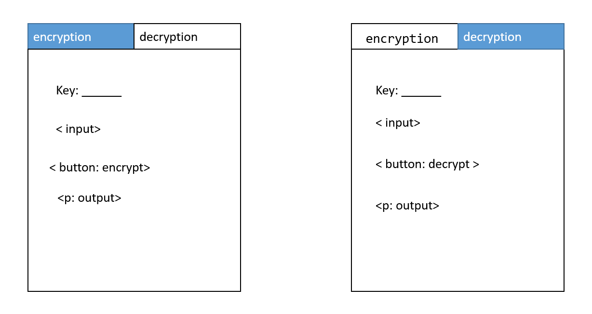

## Module 1 Lesson 02
### Javascript basics 1
(This document optimized for [reveal-md](https://github.com/webpro/reveal-md))


---

### Agenda
1. Basic DOM manipulation
1. JS basics (flow, types, strings,  Math, Functions)
1. Continue with CSS slides


---

### Basic DOM manipulation

[getElementById](https://developer.mozilla.org/en-US/docs/Web/API/Document/getElementById)
```
    <div id="moshe"></div>
    <script>
        document.getElementById('moshe').innerHTML = 'moshe';
        // or
        document.querySelector('#moshe').innerHTML = 'moshe';
    <script>
```

querySelector works like css selectors!
try: 
```
    document.querySelector('element.class');
```
<!-- .element: class="fragment" -->

---

### Basic DOM manipulation
[getElementsByClassName](https://developer.mozilla.org/en-US/docs/Web/API/Document/getElementsByClassName)
``` 
    <div class="moses" id="moshe1"></div>
    <div class="moses" id="moshe2"></div>
    <script>
        const moses = document.getElementsByClassName('moses');
        moses[0].style.backgroundColor = 'red';
    <script>
```
Other multi-elements Selector works in the same way (like: [getElementsByTagName](https://developer.mozilla.org/en-US/docs/Web/API/Document/getElementsByTagName))


Short exercise: how to do [ForEach on node elements](https://stackoverflow.com/questions/24775725/loop-through-childnodes)?
- Create a ul with 10 li elmements
<!-- .element: class="fragment" -->
- Use javascript to set each li content (index + ' mississippi')
<!-- .element: class="fragment" -->

---

### Building tabs

Build page with 2 tabs
<div style="height:300px">
    
</div>


---

### JS basics 
 - flow
 - [switch](https://www.w3schools.com/js/js_switch.asp)
 - [strings](https://developer.mozilla.org/en-US/docs/Web/JavaScript/Reference/Global_Objects/String) (and [regex](https://regexone.com/))
 - [Math](https://developer.mozilla.org/en-US/docs/Web/JavaScript/Reference/Global_Objects/Math)
 - Object types
 - Functions

Live code demo

---

### JS basics: Caesar code
Caesar code encryption / decryption page

use tab for Caesar encryption decryption and send messages to each other via slack(key is 1 to 26, hi/low case?)

---

### Practice: memory cards game
- [matching pairs game](http://mypuzzle.org/find-the-pair)
- design data structure (classes, inheritance if needed)
- design DOM manipulation in encapsulated namespace
- keep data manipulation and view **separated**

---
### Further reading
1. [Css3 flexbox](https://www.w3schools.com/css/css3_flexbox.asp)
1. [A Complete Guide to Flexbox](https://css-tricks.com/snippets/css/a-guide-to-flexbox/)
1. [Flexbox Cheatsheet](https://darekkay.com/dev/flexbox-cheatsheet.html)


---
### Home Work:
1. Finish [flexbox froggy](https://flexboxfroggy.com/)
1. Caesar code practice
1. create 4 X 4 board for [find-the-pair game](http://mypuzzle.org/find-the-pair)

### Extra
1. Finish with caesar cipher
1. [regex tutorial](https://regexone.com/)

