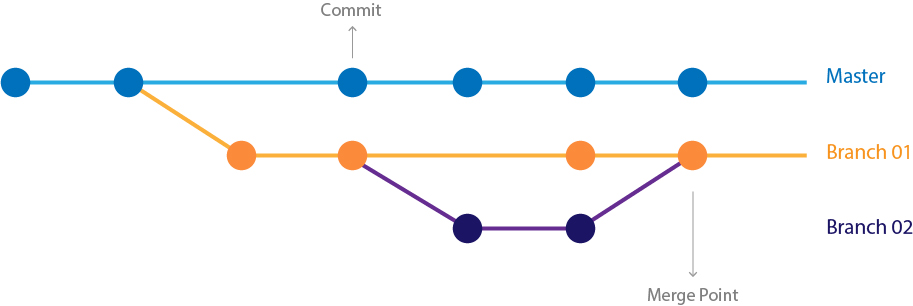

## Module 1 Lesson 03
### Javascript basics 2
(This document optimized for [reveal-md](https://github.com/webpro/reveal-md))

---

### Agenda
1. Hello Git
1. Advanced DOM manipulation
1. ES6 tips: Property Shorthand, Destructuring, spread
1. Events and Time events
1. JS Best practices and code style
1. Continue with CSS slides

---
### Hello Git

[Git core (0:00 - 3:00)](https://www.youtube.com/watch?v=_ALeswWzpBo)

<div style="float: left">
    
</div>

---

### Hello Git - Creating a local Repo

1. git init
2. git status
3. create a file named: 1.txt
4. git status
5. git add 1.txt
6. git status
7. git commit -m "first commit"

Practice: add 2 more files and commit
---

### Hello Git - Creating a Remote Repo

How to create a remote repo

Practice: push your files into a remote repo

---

### Advanced DOM manipulation: innerHTML = string
```
    document.getElementById('outputDiv').innerHTML = '<input type="color">';
```

---

### Advanced DOM manipulation: ES6 template literals
```
const dataObj = {
    name: 'inigo montoya',
    quote: 'You killed my father. Prepare to die.'
};

document.getElementById('outputDiv').innerHTML = `
    <h2>${dataObj.name}</h2>
    <blockquote>${dataObj.quote}</blockquote>
`;
```
---

### Advanced DOM manipulation: DOM fragments
```
const fragment = document.createDocumentFragment();
const container  = document.getElementById('outputDiv');
const movies = ['', 'Reloaded', 'Revolutions'];

movies.forEach(function(movie) {
    const p = document.createElement('li');
    p.textContent = 'The Matrix' + (movie ? ' : ' + movie: '');
    fragment.appendChild(p);
});

container.appendChild(fragment);
```
---

### Advanced DOM manipulation: html templates
```
const template = document.getElementById('option-template');
const listContainer  = document.getElementById('outputList');
const someMovies = ['Reservoir Dogs', 'Pulp Fiction', 'Kill Bill'];

someMovies.forEach((text, index) => {
    const newNode = template.content.cloneNode(true);
    newNode.querySelector('label').textContent  = `${index} : ${text}`;
    listContainer.appendChild(newNode);
});
```


---

### More [ES6](http://es6-features.org) tips:
- [Property Shorthand](http://es6-features.org/#PropertyShorthand)
- BTW, see the [Fragment identifier](https://en.wikipedia.org/wiki/Fragment_identifier) in the above link
- [Destructuring](https://developer.mozilla.org/en-US/docs/Web/JavaScript/Reference/Operators/Destructuring_assignment)
- [Spread](https://developer.mozilla.org/en-US/docs/Web/JavaScript/Reference/Operators/Spread_syntax)

---
### More [ES6](http://es6-features.org) tips:
- There are many more features- [research them](http://es6-features.org)
- You don't need to use all of them!

---

### [Events](https://developer.mozilla.org/en-US/docs/Web/Events)

```
    const btn = document.querySelector('button');

    btn.onclick = function() {
        const target = document.getElementById('outputDiv');
        target.style.backgroundColor = 'lightGray';
    }
    
```

---

### [Events](https://developer.mozilla.org/en-US/docs/Web/Events)

```
    const btn = document.querySelector('button');

    function bgChange() {
        const target = document.getElementById('outputDiv');
        target.style.backgroundColor = 'lightGray';
    }
    
    btn.addEventListener('click', bgChange);
```
---

### Short practice -  [Events](https://developer.mozilla.org/en-US/docs/Web/Events) 

 There are many more [event types](https://developer.mozilla.org/en-US/docs/Web/Events).
 Try:
 
 - load
 - focus
 - keyup / keydown
 
---

### Time Events
- [setTimeout](https://developer.mozilla.org/en-US/docs/Web/API/WindowOrWorkerGlobalScope/setTimeout)
- [setInterval](https://developer.mozilla.org/en-US/docs/Web/API/WindowOrWorkerGlobalScope/setInterval)

try them!
<!-- .element: class="fragment" -->


---

### JS Best practices and code style
- [jstherightway](http://jstherightway.org/#js-code-style)
- [linting](http://jslint.com/)
- [google styleguide](https://google.github.io/styleguide/javascriptguide.xml)
- airbnb
    - [strings](https://github.com/airbnb/javascript#strings)
    - [references](https://github.com/airbnb/javascript#references)
    - [objects](https://github.com/airbnb/javascript#objects)

---

### Practice: memory cards game
- [matching pairs game](http://mypuzzle.org/find-the-pair)
- design data structure (classes, inheritance if needed)
- design DOM manipulation in encapsulated namespace
- keep data manipulation and view **separated**

---

### Further reading
1. [Introduction to events](https://developer.mozilla.org/en-US/docs/Learn/JavaScript/Building_blocks/Events) - play with and understand all demos
1. Read at least 5 of AirBnB best practice guidelines
1. [What No One Told You About Z-Index](https://philipwalton.com/articles/what-no-one-told-you-about-z-index/)
---
### Home Work:
- Create a repo with [memory cards game ("Find a pair")](http://mypuzzle.org/find-the-pair)
- Finish class practice from last lesson (Caesar encryption)
- Choose 1 AirBnB guideline that was helpful to you and share it on slack