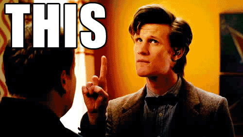

## Module 2 Lesson 4
### React Hooks
(This document is optimized for presentation using [reveal-md](https://github.com/webpro/reveal-md))

---

### Prep
* [Hooks](https://reactjs.org/docs/hooks-overview.html)

### Agenda
1. Functional vs Class Components
2. React Hooks introduction
3. Writing Custom Hooks

---

### Functional vs Class Components
Abilities and Tendencies
<table>
    <tr>
        <th>Class Component</th>
        <th>Function Component</th>
    </tr>
    <!-- .element: class="fragment" -->
    <tr><td>Stateful</td><td>Stateless</td></tr>
    <!-- .element: class="fragment" -->
    <tr><td>Lifecycle events</td><td>X</td></tr>
    <!-- .element: class="fragment" -->
    <tr><td>Complex</td><td>Simple</td></tr>
    <!-- .element: class="fragment" -->
    <tr><td>?... </td><td>Readable</td></tr>
    <!-- .element: class="fragment" -->
</table>

---

### Functional vs Class Components
And there is...
<div>
    
</div>
<!-- .element: class="fragment" -->

---

### React Hooks introduction
[Motivation:](https://reactjs.org/docs/hooks-intro.html)
>* It’s hard to reuse stateful logic between components
<!-- .element: class="fragment" -->

>* Complex components become hard to understand
<!-- .element: class="fragment" -->

>* Classes confuse both people and machines (this) 
<!-- .element: class="fragment" -->

---

### React Hooks introduction
Let's Talk about Hooks

<div>
    
</div>

---

### [Introduction to Hooks](https://reactjs.org/docs/hooks-intro.html)
* [Why using Hooks?](https://reactjs.org/docs/hooks-intro.html#motivation)
* [Hooks Overview](https://reactjs.org/docs/hooks-overview.html)
* [State hook](https://reactjs.org/docs/hooks-state.html)
* [Effect hook](https://reactjs.org/docs/hooks-effect.html)
* Live Demo & Practice

---

### [Introduction to Hooks](https://reactjs.org/docs/hooks-intro.html)
[Custom hooks](https://reactjs.org/docs/hooks-custom.html)
```
const useToggle = (initialState = false) => {
    const [state, setState] = useState<boolean>(initialState);
    const toggle = () => setState(state => !state), []);
    return [state, toggle]
}
// use:
const [isOn, setIsOn] = useToggle();
<button onClick={setIsOn}>{isOn ? 'On' : 'Off'}</button>
```

---
### [Introduction to Hooks](https://reactjs.org/docs/hooks-intro.html)
[Custom hooks](https://reactjs.org/docs/hooks-custom.html)
```
const useFormInput = (initialValue: string) => 
  const [value, setValue] = useState(initialValue);
  const onChange = (event) => {
    setValue(event.target.value);
  };
  return { value, onChange };
};
// use:
const name = useFormInput('Bob');
<input {...name}>
```
---
### [Introduction to Hooks](https://reactjs.org/docs/hooks-intro.html)
[Custom hooks](https://reactjs.org/docs/hooks-custom.html)

Practice

---
### [Introduction to Hooks](https://reactjs.org/docs/hooks-intro.html)
* [Rules of hooks](https://reactjs.org/docs/hooks-rules.html)
* [API](https://reactjs.org/docs/hooks-reference.html) & [FAQ](https://reactjs.org/docs/hooks-faq.html)

---

### Homework
On your Trivia app - convert class components to functional using hooks
 
---

### Further reading
* Must - Watch Liad Yosef Talk about [Hooks (22:00 - 30:00)](https://youtu.be/sjjaGxs3e1c?t=1328)
* Watch Ryan Florence's talk about [React Hooks (1:00:00 - 1:12:00)](https://www.youtube.com/watch?v=dpw9EHDh2bM)
* [Introducing React Hooks - 20 minutes](https://www.youtube.com/watch?v=mxK8b99iJTg)
* [Use hooks](https://usehooks.com/)
