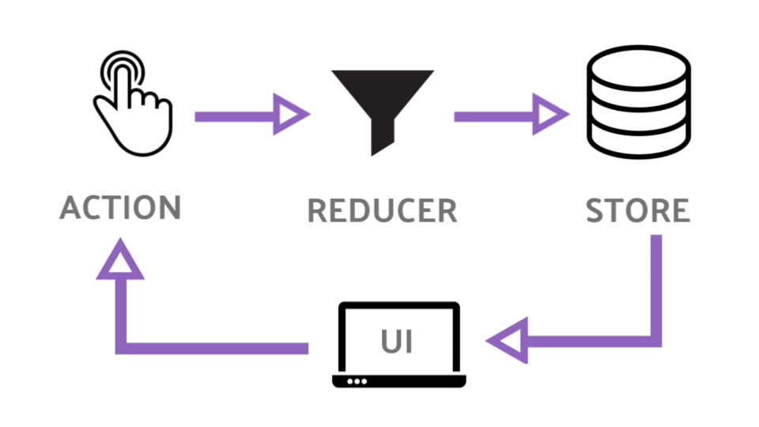

## Module 2 Lesson 7
### Let's build redux!
(This document is optimized for presentation using [reveal-md](https://github.com/webpro/reveal-md))

---


### Prep
* [Redux Explain in a simple way](https://www.youtube.com/watch?v=nFryvdyMI8s)

### Agenda
1. The problem with large scale applications
2. What is Redux?
3. Let's Build Redux
4. React with redux

---

### Problems when apps go large
* As application grows so their complexity
<!-- .element: class="fragment" -->

* Nested props are hard to maintain
<!-- .element: class="fragment" -->

* Multiple Components use & affect the same data (and each other)
<!-- .element: class="fragment" -->

* Saving application state (for later load)
<!-- .element: class="fragment" -->

---

### What is Redux?

* A design pattern (based on flux)
<!-- .element: class="fragment" -->

* redux.js - A Library which implement that design pattern
<!-- .element: class="fragment" -->

* Idea is: let's manage single source of truth, in a predictable way
<!-- .element: class="fragment" -->

* Redux dictate how to store and change your data, in a loose way
(Has Principles and best practices, but does not enforce them)
<!-- .element: class="fragment" -->

---

### What is Redux? - scheme



* [store](https://redux.js.org/api/store) - manage your stuff
* state - object represent app in a specific time
* action - plain object represent an event
* reducer - old state + action => new state


---

### What is Redux?
State
```js
let state = {
    items: []
}
```
Action
```js
store.dispatch({
    type: 'ADD_ITEM',
    payload: 'Tea cup'
})
```
---

### What is Redux?

Reducer (Pure Function!)
```js
function myReducer(state, action)(
    switch(action.type) {
        case 'ADD_ITEM':
            return {
                ...state, 
                items: state.items.concat(action.payload)
            }
    }
)
// return value will become the new state
```

---

### What is Redux?

Subscribing to changes
```js
  function select(state) {
    return state.some.deep.property
  }
  
  function myHandler() {
    const state = store.getState();
    const deepProperty = select(select);
    console.log(deepProperty);
  }

  store.subscribe(myHandler);
```

---

### What is Redux?

[Sandbox Example](https://codesandbox.io/s/redux-fundamentals-core-example-lr7k1?from-embed=&file=/index.html:1732-1738)

[Overview](https://d33wubrfki0l68.cloudfront.net/01cc198232551a7e180f4e9e327b5ab22d9d14e7/b33f4/assets/images/reduxdataflowdiagram-49fa8c3968371d9ef6f2a1486bd40a26.gif)

---

### What is Redux? - Rules

* <!-- .element: class="fragment" -->
Principles 1: [Single source of truth](https://redux.js.org/introduction/three-principles#single-source-of-truth)
* <!-- .element: class="fragment" -->
Principles 2+3: [States are immutable](https://redux.js.org/introduction/three-principles#single-source-of-truth)

```js
let state = {
    items: []
}; 
// mutable
state.items.push('Cup of Tea');
// immutable
state =  {...state, items: ['Cup of Tea']};
```
<!-- .element: class="fragment" -->

---

### What is Redux? - Rules
Best Practice #1: 

Separate data and UI state
```js
{
    items: [...],
    viewFilter: ViewFilterEnum.All,
}

```
---

### What is Redux? - Rules
Best Practice #2: 

Keep a flat data structure (like a database)
```js
{
    posts: [{
        id: 3,
        text: 'Lorem Ipsum'
    }],
    comments: [{
        id:44,
        postId: 3,
        content: 'nice post'
    }]
}

```
---

### Let's Build Redux
Live coding and practice
(files in demo library)


---

### React With redux
[Redux](redux.js.org) and [React-Redux](https://react-redux.js.org/) 

[Quick Start with RTK](https://react-redux.js.org/tutorials/quick-start)

[React Redux TypeScript Quick Start](https://react-redux.js.org/tutorials/typescript-quick-start)

[Modern Redux Video](https://redux.js.org/tutorials/index)

[Redux Dev Tools](https://chrome.google.com/webstore/detail/redux-devtools/lmhkpmbekcpmknklioeibfkpmmfibljd?hl=en)

---

### React With redux

Live Demo - Todo App

---

### React With redux

* RTK is a wrapper for redux
<!-- .element: class="fragment" -->

* RTK Uses Immer to simulate state mutation
<!-- .element: class="fragment" -->

* Slicing - grouping initial state reducer and actions 
<!-- .element: class="fragment" -->

* Typescript for hooks and PayloadAction
<!-- .element: class="fragment" -->

---

### Redux [middleware](https://redux.js.org/advanced/middleware)

<!-- .element: class="fragment" -->

Live coding and practice
<!-- .element: class="fragment" -->


---

### Further reading
* [Redux - motivation](https://redux.js.org/introduction/motivation)
* [Redux - getting-started](https://redux.js.org/introduction/getting-started)
* [middleware](https://redux.js.org/advanced/middleware)

---

### Homework
* Finish class practices
* If you missed class practice - try and build redux yourself using the snippets
