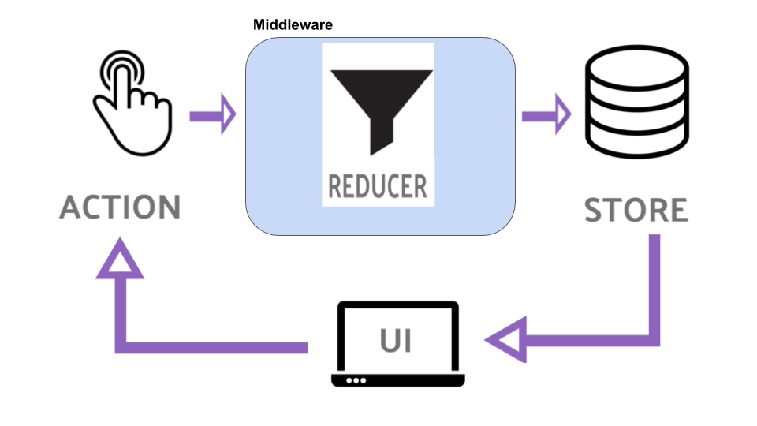

## Module 2 Lesson 8

### Fetching Data with Redux

(This document is optimized for presentation using [reveal-md](https://github.com/webpro/reveal-md))

---

### Agenda

1. The data fetch problem
2. Loading Indication
3. API middleware
4. Thunk and createAsyncThunk

---

### The data fetch problem

We already used _useEffect_ to fetch data, but since we use a global store, that would preset some issues

- with _useEffect_ we would need to update store manually (loading state, received data, errors etc)
<!-- .element: class="fragment" -->

- Multiple components might need to fetch the same data
<!-- .element: class="fragment" -->

---

### The data fetch problem

A Reminder- reducers must be pure functions!

> Redux reducers must never contain "side effects". A "side effect" is any change to state or behavior that can be seen outside of returning a value from a function

Redux middleware were designed to enable writing logic that has side effects.

<!-- .element: class="fragment" -->

---

### Loading Indication

- Always indicate about loading
<!-- .element: class="fragment" -->

- Avoid multiple spinners - prefer single loader on parent component
<!-- .element: class="fragment" -->

- Loader vs Progress indicators strategies
<!-- .element: class="fragment" -->

[Spinner vs bars](https://material-ui.com/components/progress/)

<!-- .element: class="fragment" -->

---

### API middleware


---

### API middleware



---

### API middleware

middleware - a reminder

```js
const logger = (store) => (next) => (action) => {
	console.log('action fired', action);
	const returnValue = next(action);
	console.log('after dispatch state', store.getState());
	return returnValue;
};

const store = configureStore({
	reducer: { todo: todoReducer },
	middleware: [logger],
});
```

---

### API middleware

```js
const todoApi = (store) => (next) => async(action) =>  {
  const returnValue = next(action);

  if (action.type === 'todo/fetchTodoCollection') {
    dispatch(todoLoading());
    const response = await fetch('todo.json');
    const items = await response.json();
    dispatch(todoLoaded(items));
    }
  }
  return returnValue;
}
```

---

### API middleware

Practice and Live Demo

- Add a logger middleware
- Add an API middleware
- Use API middleware to fetch data
- Use Same API middleware store the data (fire another action)
- Add loading indication

---

### API middleware

Reducers should be pure, Thus _Middleware_ should hold most of redux logic

Middleware can

- Fire actions
<!-- .element: class="fragment" -->

- Fetch data
<!-- .element: class="fragment" -->

- Route logic flow(fire data according to state / action)
<!-- .element: class="fragment" -->

---

### API middleware

Making it generic

```js
const apiMiddleware = (store) => (next) => async (action) => {
	const returnValue = next(action);

	if (action.type === 'api') {
		dispatch(apiLoading());
		const response = await fetch(action.payload.url);
		const payload = await response.json();
		dispatch({
			type: action.payload.onSuccess,
			data: payload,
		});
	}
	return returnValue;
};
```

---

### Thunk and createAsyncThunk

What is [Thunk](https://github.com/reduxjs/redux-thunk#whats-a-thunk)?

> A thunk is a function that wraps an expression to delay its evaluation.

```js
// calculation of 1 + 2 is immediate
let x = 1 + 2;

// calculation of 1 + 2 is delayed
// foo can be called later to perform the calculation
// foo is a thunk!
let foo = () => 1 + 2;
```

The term originated as a humorous past-tense version of "think".

---

### Thunk and createAsyncThunk

[Writhing Classic Redux Thunk](https://redux.js.org/usage/writing-logic-thunks#writing-thunks)

A thunk function return an async function

```js
// fetchTodoById is the "thunk action creator"
export function fetchTodoById(todoId) {
	// fetchTodoByIdThunk is the "thunk function"
	return async function fetchTodosThunk(dispatch, getState) {
		const response = await fetch(`/api/todo/${todoId}`);
		const todo = await response.json();
		dispatch(todoLoaded(todo));
	};
}
// use like any action
dispatch(fetchTodoById(4));
```

---

### Thunk and createAsyncThunk

[Redux Thunk Middleware](https://redux.js.org/usage/writing-logic-thunks#redux-thunk-middleware)

```js
const thunkMiddleware = (store) => (next) => (action) => {
	// If the "action" is actually a function instead
	if (typeof action === 'function') {
		// then call the function and pass `dispatch` and `getState` as arguments
		return action(store.dispatch, store.getState);
	}
	// Otherwise, it's a normal action - send it onwards
	return next(action);
};
```

---

### Thunk and createAsyncThunk

[Redux Thunk Typescript](https://redux.js.org/usage/usage-with-typescript#type-checking-redux-thunks)

[getDefaultMiddleware](https://redux-toolkit.js.org/api/getDefaultMiddleware)

```ts
export type AppThunk<ReturnType = void> = ThunkAction<
	ReturnType,
	RootState,
	unknown,
	AnyAction
>;
```

---

### Thunk and createAsyncThunk

Thunk Live Demo

---

### Thunk and createAsyncThunk

[createAsyncThunk](https://redux.js.org/usage/writing-logic-thunks#redux-thunk-middleware) provide easy API to create async thunk logic,
while keeping it easy and reduce repetitive code

```ts
export const incrementAsync = createAsyncThunk(
	'counter/fetchCount',
	async (amount: number) => {
		const response = await fetchCount(amount);
		// The value we return becomes the `fulfilled` action payload
		return response.data;
	}
);
```

---

### Thunk and createAsyncThunk

```ts
export const counterSlice = createSlice({
  name: 'counter',
  initialState,
  // The `reducers` field lets us define reducers and generate associated actions
  reducers: {
  //...
  extraReducers: (builder) => {
    builder
      .addCase(incrementAsync.pending, (state) => {
        state.status = 'loading';
      })
      .addCase(incrementAsync.fulfilled, (state, action) => {
        state.status = 'idle';
        state.value += action.payload;
      });
  },
});
```

---

### Thunk and createAsyncThunk

- Redux-Toolkit [Builder Callback Notation](https://redux-toolkit.js.org/api/createReducer#usage-with-the-builder-callback-notation)
- Redux-Toolkit template walk-through
- Live Demo


---

### Home Work:
- use createAsyncType to fetch data
- add logger middleware

### Extra

- watch [Learn Modern Redux Livestream](https://redux-toolkit.js.org/introduction/getting-started#learn-modern-redux-livestream)
